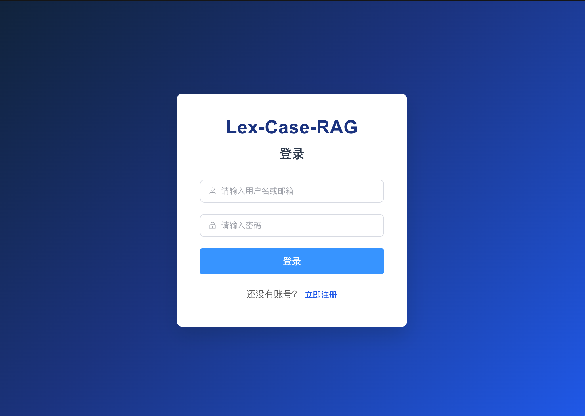
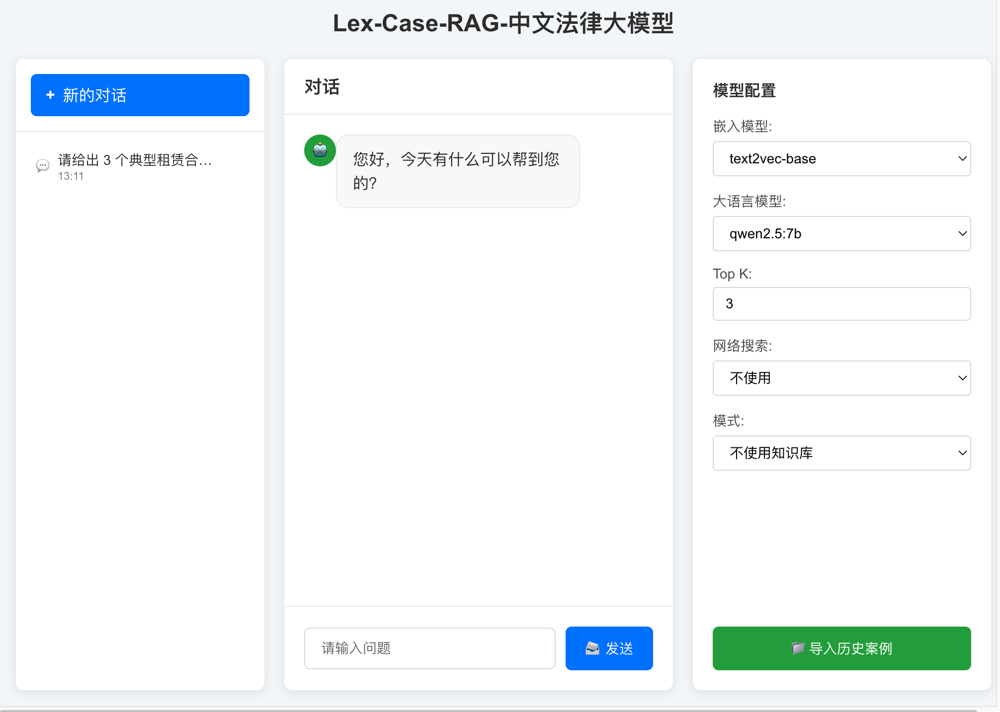
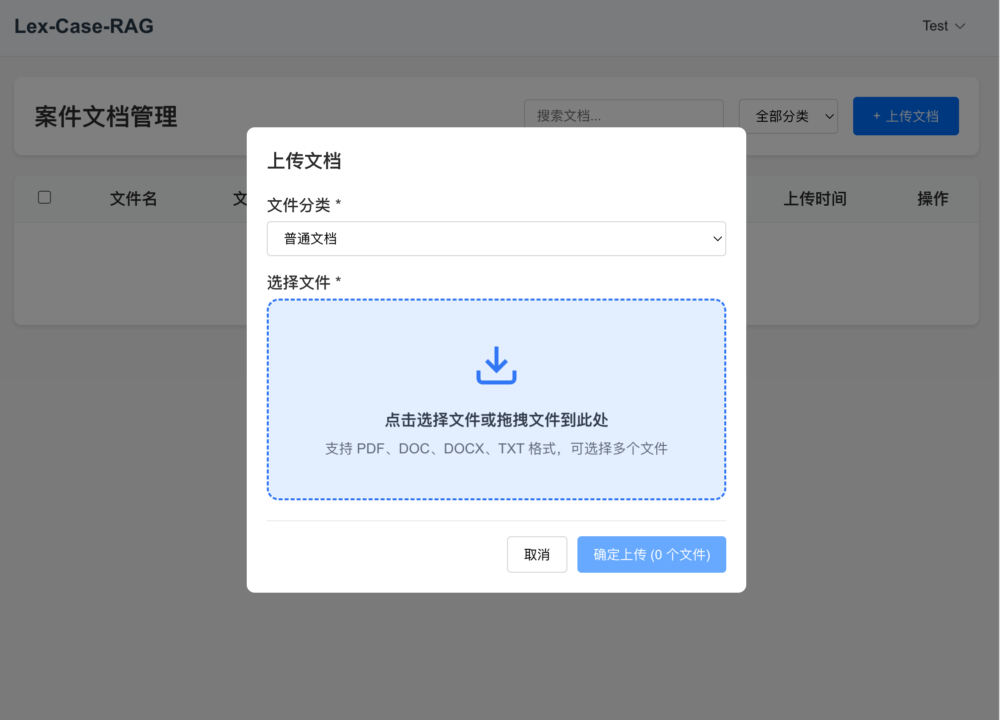
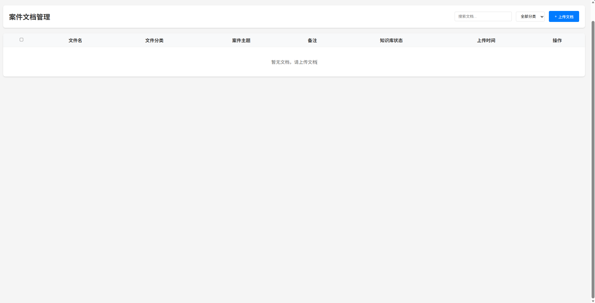

# Lex-Case-RAG

[](LICENSE)


> **环境要求：** Python 3.10+ · Node.js 18+ · npm 9+

**Lex-Case-RAG** 是一个面向法律场景的知识库问答与案件文档管理系统，采用 **Lex（法律）· Case（案件）· Mind（大模型）· RAG（检索增强）** 架构：

| 模块       | 说明 |
|----------|------|
| **Lex**  | 法律领域问答、合规提示与来源引用 |
| **Case** | 案件文档上传、分类、管理与知识入库 |
| **AI**   | 接入 Ollama / OpenAI-compatible 大语言模型 |
| **RAG**  | 本地文档切片、关键词检索与联网搜索增强 |

默认运行链路：

```text
law_front (Vue 3) → law_backend_flask (Flask) → SQLite + 本地文件存储 → 知识检索 → LLM
```

## 技术栈

### 前端

| 类别 | 技术 | 说明 |
|------|------|------|
| 框架 | Vue 3 | 组合式 / 选项式组件 |
| 构建 | Vite 5 | 开发服务器与生产构建 |
| 路由 | Vue Router 4 | 登录守卫、页面路由 |
| UI | Element Plus | 表单、消息、下拉等组件 |
| 渲染 | marked | Markdown 回答渲染 |
| 请求 | fetch / axios | REST API 调用 |
| 代理 | Vite Dev Proxy | 开发态 `/api` 转发至后端 |

### 后端

| 类别 | 技术 | 说明 |
|------|------|------|
| 框架 | Flask 2.3 | RESTful API、蓝图模块化 |
| ORM | Flask-SQLAlchemy | 用户、文件、对话、知识切片 |
| 鉴权 | Flask-JWT-Extended | Access / Refresh Token |
| 跨域 | Flask-CORS | 前后端分离访问 |
| 部署 | Gunicorn + Gevent | 生产环境 WSGI（可选） |
| 文档解析 | pypdf、python-docx | PDF / DOCX 文本抽取 |
| HTTP | requests | LLM 与联网搜索调用 |

### 数据与存储

| 类别 | 技术 | 说明 |
|------|------|------|
| 默认数据库 | SQLite | 本地零配置，开发推荐 |
| 可选数据库 | MySQL (PyMySQL) | 生产环境可切换 |
| 对象存储 | 本地文件系统 | `MINIO_DISABLED=true` 时默认 |
| 可选存储 | MinIO | 生产 / 分布式文件存储 |

### AI 与检索

| 类别 | 技术 | 说明 |
|------|------|------|
| 大模型 | OpenAI-compatible API | Ollama、OpenAI、OneAPI 等 |
| 默认模型 | qwen2.5:7b | 可通过 `.env.local` 更换 |
| 检索方式 | 本地切片 + 关键词评分 | 无需 embedding 模型 |
| 联网增强 | 搜狗 / Bing RSS | 可选 Web Search 补充 |

## 设计架构

### 总体分层

```text
┌─────────────────────────────────────────────────────────┐
│  表现层   law_front (Vue 3)                              │
│           登录 · 对话 · 案件文档管理 · 模型配置           │
├─────────────────────────────────────────────────────────┤
│  接口层   Flask Blueprints (/api/*)                     │
│           auth · documents · conversations · qa · system │
├─────────────────────────────────────────────────────────┤
│  业务层   用户鉴权 · 文件管理 · 知识入库 · 问答编排      │
├─────────────────────────────────────────────────────────┤
│  数据层   SQLite · 本地/MinIO 对象存储 · KnowledgeChunk  │
├─────────────────────────────────────────────────────────┤
│  外部服务  OpenAI-compatible LLM · 联网搜索（可选）       │
└─────────────────────────────────────────────────────────┘
```

### Lex-Case-RAG 协作关系

```text
         ┌────────── Case ──────────┐
         │  案件文档上传 / 分类 / 管理 │
         └────────────┬─────────────┘
                      │ 入库切片
                      ▼
┌──────── RAG ────────┴──────── Mind ────────┐
│  文档解析 → 分块 → 关键词检索 → Prompt 组装   │
│  公有/私有库隔离    →  LLM 生成回答          │
│  联网搜索（可选）   ←  来源引用 / 回退策略    │
└────────────────── Lex ──────────────────────┘
              法律提示词 · 合规声明 · 引用标注
```

## 功能特性

- 用户注册、登录、JWT 鉴权
- 多轮对话与历史记录持久化
- 案件 / 合同 / 模板等文档分类管理
- PDF、DOCX、TXT、JSON 上传与预览
- 公有 / 私有知识库隔离与检索
- 回答附带来源片段，支持联网搜索补充
- MinIO 不可用时自动回退本地文件存储
- 支持 Ollama、LM Studio、vLLM、OpenAI 等兼容接口

## 系统截图

<p align="center">
  
</p>

<p align="center">
  
</p>

<p align="center">
  
</p>[README.md](README.md)

<p align="center">
  
</p>

## 快速开始

### 1. 克隆项目

```bash
git clone https://github.com/gstranded/RAGLEX.git
cd RAGLEX
```

### 2. 配置环境

```bash
cp .env.local.example .env.local
```

默认使用 SQLite、关闭 MinIO、连接本地 Ollama。macOS 若 **5000 端口被 AirPlay 占用**，可在 `.env.local` 中改为：

```env
BACKEND_PORT=5001
VITE_PROXY_TARGET=http://127.0.0.1:5001
```

### 3. 准备 Python 环境

```bash
python3 -m venv .venv
.venv/bin/pip install -r law_backend_flask/requirements.txt
```

或使用脚本：

```bash
./scripts/bootstrap_python.sh
```

### 4. 准备前端依赖

```bash
cd law_front && npm install && cd ..
```

### 5. 准备 LLM（可选，问答功能需要）

```bash
ollama serve
./scripts/pull_ollama_model.sh
```

资源有限时可使用更小模型：

```bash
OLLAMA_MODEL=qwen2.5:3b ./scripts/pull_ollama_model.sh
```

### 6. 初始化默认账号（可选）

后端启动只会建表，不会自动创建用户。如需默认账号：

```bash
.venv/bin/python law_backend_flask/init_db.py
```

| 用户名 | 密码 | 角色 |
|--------|------|------|
| `admin` | `admin123` | 管理员 |
| `testuser` | `test123` | 普通用户 |

也可在前端登录页直接注册。

> **注意：** `init_db.py` 会清空现有数据后重建。

### 7. 启动服务

**一键启动：**

```bash
./deploy.sh
```

**或分别启动：**

```bash
./scripts/run_backend_sqlite.sh   # 后端
./scripts/run_frontend.sh         # 前端
```

**访问地址：**

| 服务 | 地址 |
|------|------|
| 前端 | http://127.0.0.1:13000 |
| 后端 | http://127.0.0.1:5000（或 `.env.local` 中配置的端口） |
| 健康检查 | http://127.0.0.1:5000/api/health |

## 知识库使用流程

1. 注册并登录
2. 进入「案件文档管理」或文件管理页
3. 上传 PDF / DOCX / TXT / JSON
4. 选择上传到公有或私有知识库
5. 在问答页选择检索模式：
   - 使用公有知识库
   - 使用私有知识库
   - 使用整个知识库
   - 不使用知识库
6. 可选开启「网络搜索」
7. 提问并查看答案与来源

## 模型配置

项目不内置模型权重，通过 OpenAI-compatible API 调用推理服务。

`.env.local` 示例：

```env
OPENAI_COMPAT_BASE_URL=http://127.0.0.1:11434/v1
OPENAI_COMPAT_API_KEY=ollama
OPENAI_CHAT_MODEL=qwen2.5:7b
```

接入外部服务：

```env
OPENAI_COMPAT_BASE_URL=https://your-endpoint.example.com/v1
OPENAI_COMPAT_API_KEY=your-api-key
OPENAI_CHAT_MODEL=gpt-4o-mini
```

当前默认链路使用**本地切片 + 关键词检索**，无需额外 embedding 模型。前端「嵌入模型」下拉框为兼容旧界面保留。

## 目录结构

```text
├── law_front/              # Vue 3 前端（Lex-Case-RAG 界面）
├── law_backend_flask/      # Flask 后端 API
├── RAGLEX-main/            # 旧版 FastAPI RAG 实验（非默认链路）
├── scripts/                # 部署、启动、测试脚本
├── picture/                # 文档截图
├── .env.local.example      # 本地配置模板
├── deploy.sh               # 一键部署入口
├── RUN_LOCAL.md            # 最小启动说明
└── DEPLOYMENT.md           # 生产部署说明
```

## 常用脚本

| 脚本 | 作用 |
|------|------|
| `./deploy.sh` | 一键本地部署 |
| `./scripts/start_local.sh` | 后台启动前后端 |
| `./scripts/stop_local.sh` | 停止服务 |
| `./scripts/status_local.sh` | 查看运行状态 |
| `./scripts/smoke_local.sh` | 冒烟测试 |
| `./scripts/regression_local.sh` | 完整功能回归 |

查看日志：

```bash
tail -f .logs/backend.log
tail -f .logs/frontend.log
```

## 本地数据位置

| 类型 | 路径 |
|------|------|
| SQLite | `law_backend_flask/data/raglex-dev.sqlite3` |
| 文件存储 | `law_backend_flask/data/local_object_store/` |
| 日志 | `.logs/` |
| PID | `.run/` |

## 常见问题

### 登录提示「网络错误」

- 确认后端已启动：`curl http://127.0.0.1:5001/api/health`
- 确认前端 API 代理端口与 `BACKEND_PORT` 一致
- macOS 上 5000 端口常被系统占用，建议改用 5001
- 若 13000 端口有旧进程，请重启前端或访问脚本输出的实际端口

### 登录提示「用户不存在」

默认账号需执行 `init_db.py` 初始化，或在前端注册新用户。

### 问答无响应

确认 Ollama 或配置的 LLM 服务已启动：

```bash
curl http://127.0.0.1:11434/v1/models
```

模型不可用时，知识库检索模式仍会尝试返回资料片段摘要。

### 致谢

感谢github开源项目[LawBrain]及其他法律RAG项目。

